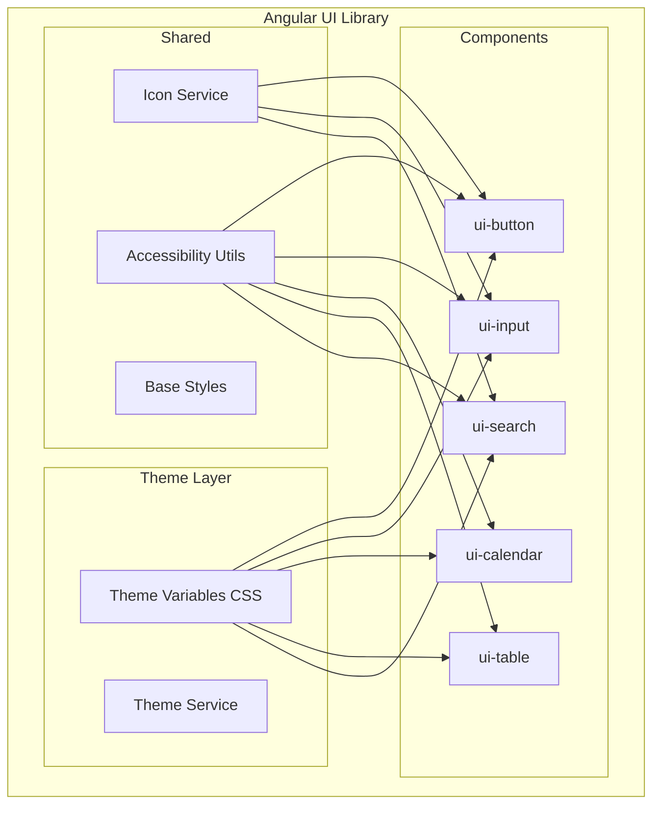
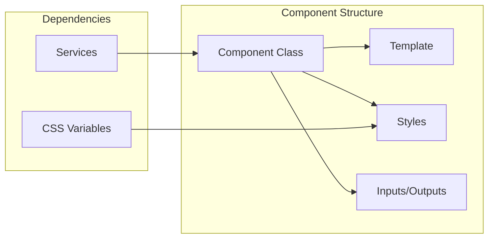

# Design Document: Angular UI Template Library

## Overview

This design document outlines the architecture and implementation details for an Angular UI Template Library. The library provides five core standalone components (Button, Input, Calendar, Table, Search) with a CSS variable-based theming system supporting light and dark modes. The library is built using Angular Standalone Components, ensuring tree-shakeability and minimal bundle size.

## Architecture

### High-Level Architecture



### Component Architecture Pattern

Each component follows the Angular Standalone Component pattern:



## Components and Interfaces

### Theme Service Interface

```typescript
interface ThemeService {
  currentTheme: Signal<'light' | 'dark'>;
  setTheme(theme: 'light' | 'dark'): void;
  toggleTheme(): void;
}
```

### Button Component Interface

```typescript
interface ButtonComponent {
  // Inputs
  variant: 'primary' | 'secondary' | 'outline';
  size: 'sm' | 'md' | 'lg';
  disabled: boolean;
  loading: boolean;
  iconLeft: string | null;
  iconRight: string | null;
  
  // Outputs
  clicked: EventEmitter<MouseEvent>;
}
```

### Input Component Interface

```typescript
interface InputComponent {
  // Inputs
  label: string;
  placeholder: string;
  type: 'text' | 'number' | 'email' | 'password';
  value: string;
  disabled: boolean;
  error: string | null;
  prefixIcon: string | null;
  suffixIcon: string | null;
  
  // Outputs
  valueChange: EventEmitter<string>;
}
```

### Calendar Component Interface

```typescript
interface CalendarComponent {
  // Inputs
  mode: 'single' | 'range';
  value: Date | [Date, Date] | null;
  minDate: Date | null;
  maxDate: Date | null;
  showTime: boolean;
  
  // Outputs
  valueChange: EventEmitter<Date | [Date, Date]>;
}

interface CalendarDay {
  date: Date;
  isCurrentMonth: boolean;
  isToday: boolean;
  isSelected: boolean;
  isInRange: boolean;
  isDisabled: boolean;
}
```

### Table Component Interface

```typescript
interface TableColumn {
  field: string;
  title: string;
  sortable?: boolean;
  visible?: boolean;
  width?: string;
}

interface SortEvent {
  field: string;
  direction: 'asc' | 'desc' | null;
}

interface PageEvent {
  page: number;
  pageSize: number;
}

interface TableComponent {
  // Inputs
  columns: TableColumn[];
  data: any[];
  pageSize: number;
  searchable: boolean;
  sortable: boolean;
  columnManager: boolean;
  serverMode: boolean;
  
  // Outputs
  sortChange: EventEmitter<SortEvent>;
  pageChange: EventEmitter<PageEvent>;
  searchChange: EventEmitter<string>;
  columnVisibilityChange: EventEmitter<TableColumn[]>;
  rowClick: EventEmitter<any>;
}
```

### Search Component Interface

```typescript
interface SearchComponent {
  // Inputs
  placeholder: string;
  value: string;
  debounce: number; // default 300ms
  disabled: boolean;
  
  // Outputs
  valueChange: EventEmitter<string>;
}
```

## Data Models

### Theme Configuration

```typescript
interface ThemeConfig {
  name: 'light' | 'dark';
  variables: {
    colorBg: string;
    colorSurface: string;
    colorText: string;
    colorPrimary: string;
    colorSecondary: string;
    colorBorder: string;
  };
}

const LIGHT_THEME: ThemeConfig = {
  name: 'light',
  variables: {
    colorBg: '#ffffff',
    colorSurface: '#f6f7f8',
    colorText: '#222',
    colorPrimary: '#3b82f6',
    colorSecondary: '#6b7280',
    colorBorder: '#d1d5db'
  }
};

const DARK_THEME: ThemeConfig = {
  name: 'dark',
  variables: {
    colorBg: '#111827',
    colorSurface: '#1f2937',
    colorText: '#f3f4f6',
    colorPrimary: '#60a5fa',
    colorSecondary: '#9ca3af',
    colorBorder: '#374151'
  }
};
```

### Button Size Configuration

```typescript
interface ButtonSizeConfig {
  padding: string;
  fontSize: string;
}

const BUTTON_SIZES: Record<'sm' | 'md' | 'lg', ButtonSizeConfig> = {
  sm: { padding: '4px 10px', fontSize: '12px' },
  md: { padding: '6px 14px', fontSize: '14px' },
  lg: { padding: '10px 20px', fontSize: '16px' }
};
```

### Calendar State

```typescript
interface CalendarState {
  currentMonth: Date;
  selectedDate: Date | null;
  selectedRange: [Date, Date] | null;
  focusedDate: Date;
  viewMode: 'days' | 'months' | 'years';
}
```

### Table State

```typescript
interface TableState {
  currentPage: number;
  pageSize: number;
  sortField: string | null;
  sortDirection: 'asc' | 'desc' | null;
  searchQuery: string;
  visibleColumns: string[];
}
```


## Correctness Properties

*A property is a characteristic or behavior that should hold true across all valid executions of a system-essentially, a formal statement about what the system should do. Properties serve as the bridge between human-readable specifications and machine-verifiable correctness guarantees.*

### Property 1: Button variant applies correct CSS class
*For any* valid button variant ("primary", "secondary", "outline"), the Button_Component SHALL apply the corresponding CSS class that matches the variant name.
**Validates: Requirements 2.1**

### Property 2: Button size applies correct padding
*For any* valid button size ("sm", "md", "lg"), the Button_Component SHALL apply the corresponding padding value from the size configuration map.
**Validates: Requirements 2.2**

### Property 3: Disabled state prevents interaction
*For any* component (Button, Input, Search) with disabled=true, the component SHALL have the disabled attribute set and SHALL NOT emit click or value change events when interaction is attempted.
**Validates: Requirements 2.3, 3.5, 6.5**

### Property 4: Loading state blocks button clicks
*For any* Button_Component with loading=true, click events SHALL NOT be emitted when the button is clicked.
**Validates: Requirements 2.4**

### Property 5: Icon inputs render in correct positions
*For any* Button_Component with iconLeft or iconRight inputs, or Input_Component with prefixIcon or suffixIcon inputs, the icon elements SHALL appear in the corresponding DOM positions (left/prefix before content, right/suffix after content).
**Validates: Requirements 2.5, 3.3**

### Property 6: Keyboard activation triggers button click
*For any* focused Button_Component that is not disabled and not loading, pressing Enter or Space key SHALL emit a click event.
**Validates: Requirements 2.6**

### Property 7: Input label association
*For any* Input_Component with a label input, the rendered label element SHALL be associated with the input element via the "for" attribute matching the input's "id".
**Validates: Requirements 3.1**

### Property 8: Input error state display
*For any* Input_Component with a non-empty error input, the error message SHALL be displayed and the input SHALL have an error CSS class applied.
**Validates: Requirements 3.2**

### Property 9: Input value change emission
*For any* Input_Component, when the input value changes, the valueChange event SHALL emit with the new value matching the input's current value.
**Validates: Requirements 3.4**

### Property 10: Calendar single mode maintains single selection
*For any* Calendar_Component in "single" mode, selecting a new date SHALL replace the previously selected date, resulting in exactly one selected date.
**Validates: Requirements 4.1**

### Property 11: Calendar range mode maintains two-date selection
*For any* Calendar_Component in "range" mode, after completing a range selection, the value SHALL contain exactly two dates where the first date is less than or equal to the second date.
**Validates: Requirements 4.2**

### Property 12: Calendar month navigation round-trip
*For any* Calendar_Component displaying month M, navigating forward one month then backward one month SHALL return to displaying month M.
**Validates: Requirements 4.3**

### Property 13: Calendar date constraints enforcement
*For any* Calendar_Component with minDate and/or maxDate constraints, dates outside the valid range SHALL have isDisabled=true and SHALL NOT be selectable.
**Validates: Requirements 4.4**

### Property 14: Calendar keyboard navigation
*For any* Calendar_Component with a focused date, pressing arrow keys SHALL move focus to the adjacent date in the corresponding direction (left=-1 day, right=+1 day, up=-7 days, down=+7 days).
**Validates: Requirements 4.7**

### Property 15: Table column rendering matches configuration
*For any* Table_Component with a columns configuration, the number of rendered column headers SHALL equal the number of columns with visible=true (or visible undefined).
**Validates: Requirements 5.1**

### Property 16: Table sort toggle cycle
*For any* Table_Component sortable column, clicking the column header SHALL cycle the sort direction through: null → 'asc' → 'desc' → null, and emit sortChange with the correct field and direction.
**Validates: Requirements 5.2**

### Property 17: Table pagination event emission
*For any* Table_Component pagination action (page change or page size change), the pageChange event SHALL emit with the correct page number and pageSize values.
**Validates: Requirements 5.3**

### Property 18: Table search event emission
*For any* Table_Component with searchable=true, typing in the search field SHALL emit searchChange with the current search query value.
**Validates: Requirements 5.4**

### Property 19: Table column visibility event emission
*For any* Table_Component column visibility toggle, the columnVisibilityChange event SHALL emit with the complete updated column configuration reflecting the visibility change.
**Validates: Requirements 5.6**

### Property 20: Table server mode delegates to events
*For any* Table_Component with serverMode=true, sort, page, and search operations SHALL emit events without modifying the internal data array.
**Validates: Requirements 5.7**

### Property 21: Search debounce delays emission
*For any* Search_Component with debounce value D, rapid input changes within D milliseconds SHALL result in only one valueChange emission after the debounce period.
**Validates: Requirements 6.1, 6.2**

### Property 22: Search escape clears value
*For any* Search_Component with a non-empty value, pressing the Escape key SHALL clear the value to an empty string and emit valueChange with empty string.
**Validates: Requirements 6.4**

### Property 23: Components support keyboard focus
*For any* interactive component (Button, Input, Calendar, Table, Search), the component's primary interactive element SHALL have a tabindex that allows keyboard focus.
**Validates: Requirements 7.1**

### Property 24: ARIA labels present on icon elements
*For any* Button_Component or Input_Component with icon inputs, the icon elements SHALL have aria-label or aria-hidden attributes for accessibility.
**Validates: Requirements 7.2**

## Error Handling

### Component Input Validation

| Component | Input | Invalid Value Handling |
|-----------|-------|----------------------|
| Button | variant | Default to 'primary' if invalid |
| Button | size | Default to 'md' if invalid |
| Input | type | Default to 'text' if invalid |
| Calendar | mode | Default to 'single' if invalid |
| Calendar | minDate/maxDate | Ignore if minDate > maxDate |
| Table | columns | Render empty table if empty array |
| Table | pageSize | Default to 10 if invalid |
| Search | debounce | Default to 300 if invalid or negative |

### Event Error Handling

- All event emissions are wrapped in try-catch to prevent component crashes
- Invalid date selections in Calendar are silently ignored
- Table sort/filter operations handle null/undefined data gracefully

### Accessibility Error Prevention

- Missing ARIA labels generate console warnings in development mode
- Focus management errors fall back to document.activeElement

## Testing Strategy

### Testing Framework

- **Unit Testing**: Jasmine with Angular TestBed
- **Property-Based Testing**: fast-check library for TypeScript
- **Component Testing**: Angular Testing Library for DOM interactions

### Unit Testing Approach

Unit tests will cover:
- Component initialization with default values
- Specific input/output combinations
- Edge cases (empty strings, null values, boundary dates)
- Integration between components (Table using Search)

### Property-Based Testing Approach

Property-based tests will use fast-check to verify correctness properties:
- Each property from the Correctness Properties section will have a corresponding PBT
- Tests will run a minimum of 100 iterations
- Each test will be tagged with: `**Feature: angular-ui-library, Property {number}: {property_text}**`

### Test Organization

```
src/
├── lib/
│   ├── button/
│   │   ├── button.component.ts
│   │   ├── button.component.spec.ts      # Unit tests
│   │   └── button.component.pbt.spec.ts  # Property-based tests
│   ├── input/
│   │   ├── input.component.ts
│   │   ├── input.component.spec.ts
│   │   └── input.component.pbt.spec.ts
│   ├── calendar/
│   │   ├── calendar.component.ts
│   │   ├── calendar.component.spec.ts
│   │   └── calendar.component.pbt.spec.ts
│   ├── table/
│   │   ├── table.component.ts
│   │   ├── table.component.spec.ts
│   │   └── table.component.pbt.spec.ts
│   └── search/
│       ├── search.component.ts
│       ├── search.component.spec.ts
│       └── search.component.pbt.spec.ts
```

### Property Test Generators

```typescript
// Button variant generator
const buttonVariantArb = fc.constantFrom('primary', 'secondary', 'outline');

// Button size generator
const buttonSizeArb = fc.constantFrom('sm', 'md', 'lg');

// Date generator within reasonable range
const dateArb = fc.date({ min: new Date(2020, 0, 1), max: new Date(2030, 11, 31) });

// Table column generator
const tableColumnArb = fc.record({
  field: fc.string({ minLength: 1, maxLength: 20 }),
  title: fc.string({ minLength: 1, maxLength: 50 }),
  sortable: fc.boolean(),
  visible: fc.boolean(),
  width: fc.option(fc.string())
});

// Search input with debounce
const searchInputArb = fc.record({
  value: fc.string(),
  debounce: fc.integer({ min: 0, max: 1000 })
});
```
